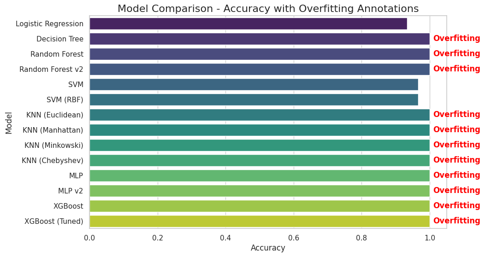

# Iris Flower Classification - Machine Learning Report
I want it to be super useful for beginners! 😊✨

## Overview

In this project, we explore various machine learning models to classify the **Iris flower dataset**, a classic dataset in the machine learning community. The dataset contains **150 samples** from **three species of Iris flowers** (`setosa`, `versicolor`, `virginica`) with **four features**: sepal length, sepal width, petal length, and petal width. The goal of the project is to **classify the species** of a given Iris flower based on these four features.

While this dataset is simple and relatively small, it provides an excellent introduction to machine learning concepts, including **model selection**, **overfitting**, and **hyperparameter tuning**.

## Models Tested

### 1. **Logistic Regression**
   - **Goal**: Predict the species based on linear relationships between the features.
   - **Performance**: Logistic regression works well on simple datasets, but it struggles to capture more complex relationships.

### 2. **Decision Tree**
   - **Goal**: Use a tree-like model to make decisions based on feature splits.
   - **Performance**: Decision Trees can lead to **overfitting** if they are too deep or complex, leading to 100% accuracy on the training set but poor generalization on new data.

### 3. **Random Forest**
   - **Goal**: Use an ensemble of decision trees to improve accuracy and reduce overfitting.
   - **Performance**: Random Forest performed better than a single Decision Tree, but overfitting was still a challenge due to the simplicity of the dataset.

### 4. **K-Nearest Neighbors (KNN)**
   - **Goal**: Classify a flower based on its **distance** to its nearest neighbors in the feature space.
   - **Performance**: KNN performed well, but the choice of **distance metric** (Euclidean, Manhattan, Minkowski, Chebyshev) heavily influenced the model's performance. Higher values of **k** can help reduce overfitting.

### 5. **Multilayer Perceptron (MLP)**
   - **Goal**: Use a simple **Neural Network** with one or more hidden layers to learn complex patterns.
   - **Performance**: Even with a simple network, MLP models tended to **overfit** the data, achieving 100% accuracy on both training and test sets.

### 6. **XGBoost (Extreme Gradient Boosting)**
   - **Goal**: Use **boosting** techniques to combine multiple weak models into a strong classifier.
   - **Performance**: XGBoost achieved the highest accuracy, but it was also prone to overfitting due to the simple nature of the dataset. Techniques like **early stopping** were used to mitigate this, but overfitting still occurred.

## Key Concepts

### **Overfitting**
Overfitting is when a model performs exceptionally well on the training data but fails to generalize to unseen data. This is a significant issue, especially for small datasets like the Iris dataset. Overfitting typically occurs when:
   - A model is too complex (e.g., a deep decision tree or too many neurons in a neural network).
   - The dataset is small and lacks noise or complexity, making it easy for the model to memorize the data.

### **Model Tuning and Regularization**
   - **Hyperparameters**: Each model has hyperparameters (like `max_depth` for decision trees, or `n_neighbors` for KNN) that influence performance. Tuning these hyperparameters can help reduce overfitting.
   - **Regularization**: Techniques such as **L1/L2 regularization** (for logistic regression and neural networks) and **pruning** (for decision trees) are useful for controlling model complexity.

### **Cross-Validation**
   - Cross-validation is a technique used to assess how well a model generalizes. In this project, **5-fold cross-validation** was applied to verify model performance. While the models performed well on the training set, cross-validation showed that they struggled to generalize, as evidenced by overfitting signs (100% accuracy on training and test data).

## Model Evaluation Metrics

For each model, the following evaluation metrics were used:
   - **Accuracy**: The percentage of correct predictions.
   - **Confusion Matrix**: Shows the true positives, false positives, true negatives, and false negatives.
   - **Classification Report**: Contains precision, recall, and F1-score for each class.

### **Overfitting Indicators**
If a model achieved **100% accuracy** on both the training and test data, it was considered to be overfitting. These models **memorized** the training data rather than learning generalizable patterns. For such models, we annotated the graph with the label **“Overfitting”** to indicate the potential issue.

## Key Findings

- **Overfitting on Small Datasets**: On a small dataset like Iris, models tend to overfit easily, especially when the model complexity is not controlled. This is why many of the models (e.g., Random Forest, XGBoost, MLP) showed **100% accuracy** but were still overfitting.
- **Importance of Model Regularization**: Using techniques like **early stopping** for XGBoost or reducing the complexity of decision trees helped slightly, but overfitting was still a challenge.
- **KNN's Sensitivity to Distance Metric**: KNN models were very sensitive to the distance metric used (e.g., **Euclidean**, **Manhattan**, **Minkowski**, **Chebyshev**). Experimenting with different values of **k** and choosing the right distance metric helped to some extent.
- **Simpler Models**: **Logistic Regression** and **Decision Trees** were less prone to overfitting compared to models like MLP or XGBoost, but they still showed signs of overfitting due to the simplicity of the dataset.

## Visualization

We visualized the performance of each model using a **bar plot** comparing the **accuracy**. Models that achieved **100% accuracy** were labeled as **overfitting** to highlight the overfitting problem. This allowed for a quick comparison of how well each model performed on the Iris dataset and how **overfitting** impacted model performance.

## Conclusion

The **Iris dataset** is an excellent starting point for machine learning beginners due to its simplicity. However, it also highlights the common problem of **overfitting** when using more complex models like **XGBoost** and **MLP**. In real-world problems, datasets are typically more complex and noisy, and these models are better suited for those scenarios.

For small datasets like Iris, simpler models such as **Logistic Regression** or **Decision Trees** (with proper tuning) are often more effective in preventing overfitting. As you gain experience, you can explore more complex datasets and models like **XGBoost** and **Neural Networks**.

